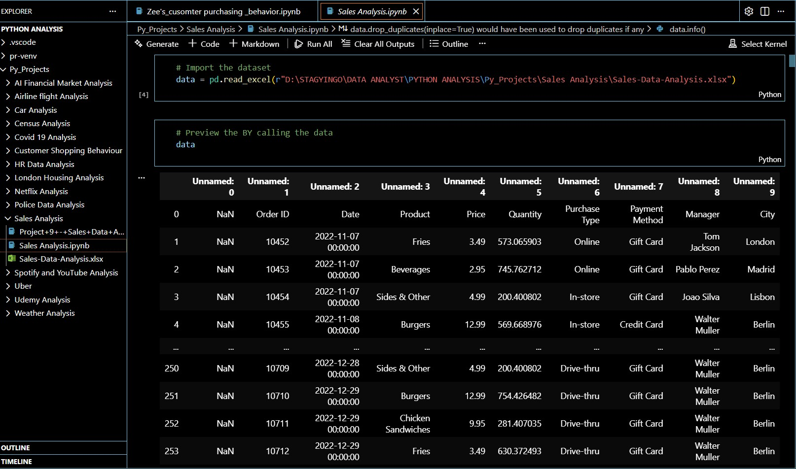
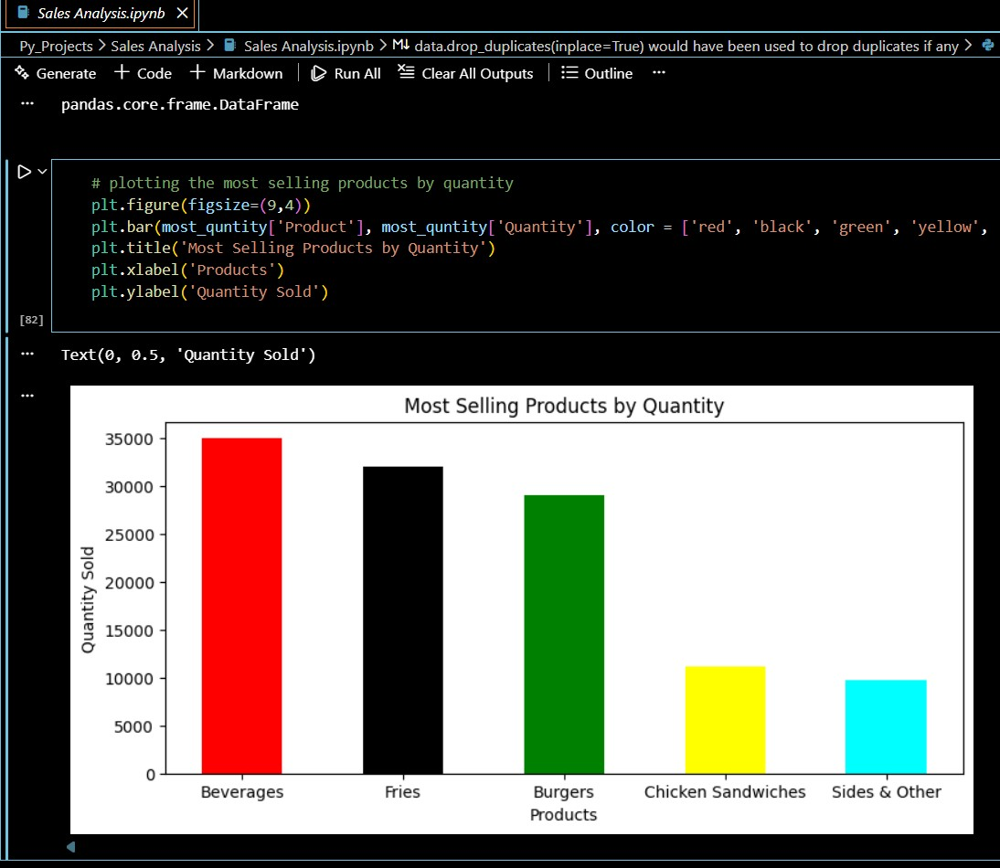
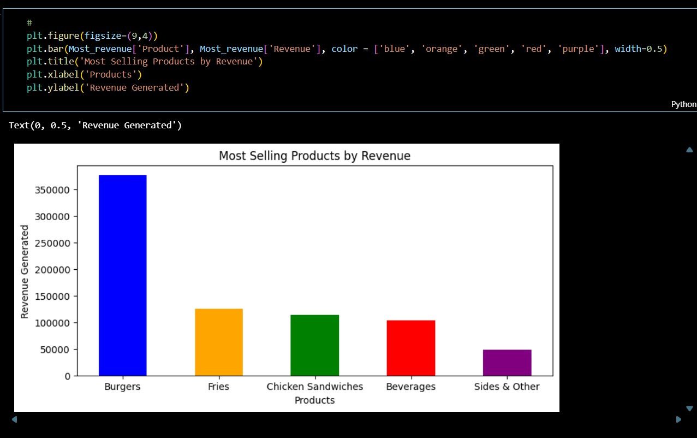
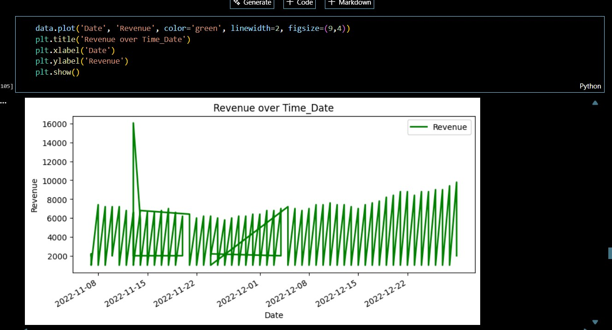
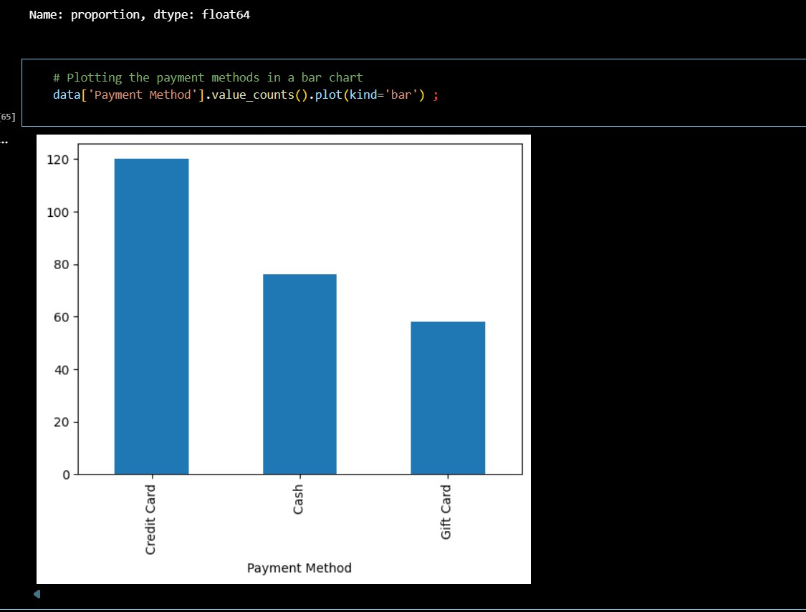

# 📊 Bea Mart Sales Analysis Project Documentation

## 🚀 Project Overview
This project involves a comprehensive Sales Data Analysis to extract actionable insights and trends, providing a clear understanding of key performance indicators (KPIs)
and drivers of sales success from Bea Mart Sales Dataset. The analysis leverages Python and popular data science libraries within a Jupyter Notebook environment, with the final deliverable being this documented repository.
The analysis includes various stages such as data cleaning, exploratory data analysis (EDA), visualization, and reporting. 
The main focus is to uncover patterns in sales performance, customer behavior, and product trends.

## Data Description 
Data Sources
The primary data used for this analysis is sourced from the Bea Mart sales database. The dataset includes the following key attributes:

Preview of dataset shown below;

## 🐍 Libraries and Tools
The following Python libraries were instrumental in this analysis:
- The following Python libraries were utilized throughout the analysis:
- Pandas: For data manipulation, cleaning, and preparation
- NumPy: For numerical operations and handling missing values
- Matplotlib: For data visualization (charts and graphs)
- Seaborn: For advanced visualizations and statistical plotting
- Plotly: For interactive visualizations
- Datetime: For working with date and time-related data
- Jupyter Notebook	Interactive computing environment used for documentation, code execution, and visualization.

## 💻 Methodology
The analysis follows a standard data science pipeline, ensuring reproducibility and clarity.
1. Data Acquisition and LoadingThe raw sales data was loaded into a Pandas DataFrame directly from a CSV file.
- Initial inspection included checking data types, the number of rows and columns, and reviewing the first few entries.
  
2. Data Cleaning and PreprocessingThe following steps were taken to ensure the data quality
- Handling Missing Values: Null values were identified. Decisions were made on whether to impute them (with median) or drop the records entirely, depending on the volume and context.
- Data Type Conversion: Columns were verified for correct data types. For instance, the 'Order Date' column was converted to the datetime format, which is critical for time-series analysis.
- Outlier Detection: Sales and Quantity figures were checked for extreme outliers, and a capping or removal strategy was applied to prevent skewing the aggregate statistics.

3. Feature EngineeringNew features were derived to enrich the analysis
- Revenue Calculation: A 'Revenue' column was created: $\text{Revenue} = \text{Quantity} \times \text{Price}$.
- Time-based Features: 'Month', 'Year', and 'Day of Week' columns were extracted from the 'Order Date' for granular temporal analysis.

4. Exploratory Data Analysis (EDA) and VisualizationKey metrics and relationships were explored using statistical summaries and visualizations:Time-Series Analysis: Visualizing monthly and yearly sales trends.

## Exploratory Data Analysis (EDA)
Exploratory Data Analysis (EDA)
The following analyses were conducted as part of the exploratory data analysis:
- Descriptive Statistics: Calculated key metrics such as mean, median, and standard deviation for numerical columns to understand central tendencies and dispersion.
- Sales Trends: Analyzed sales over time to identify any seasonal patterns, trends, and anomalies.
- Customer Segmentation: Investigated customer demographics and purchase behavior, identifying high-value customers and the most frequent purchasing patterns.
- Product Performance: Analyzed which products were performing best and which were underperforming based on metrics like total sales, quantity sold, and product category.
- Correlation Analysis: Conducted correlation analysis between variables to explore relationships between sales performance, product pricing, quantity sold, and other factors.

## Data Visualization
Data visualization was performed to present the findings in a clear, digestible format. The following types of visualizations were used:
- Time Series Plots: To visualize sales trends over time (e.g., monthly or quarterly sales).
- Bar Charts: To compare product performance and sales by category.
-  Line chart for the time series analysis visualization
- Scatter Plots: To understand the relationship between two numerical variables, such as price vs. quantity sold.

 Products by Quantity         |     Products by Revenue
:----------------------:|:-------------------------:
        | 

TTime Series         |    Payment Method
:----------------------:|:-------------------------:
        | 

## 📈 Key Insights
- Steady upward trend in total sales from mid december.
- Revenue spikes observed during mid novemeber.
- Burgers stand tall as the top product by revenue, contribute over 60% of revenue, indicating a strong Pareto effect.
- Chicken sandwich and side / other underperformed across all regions, suggesting review of pricing or marketing.
- High correlation found between discount rate and sales volume, indicating promotional sensitivity.

## 📌 Conclusions
Sales performance is influenced by product concentration, seasonal demand, and customer segmentation.
The business has clear opportunities to capitalize on high-performing products while addressing persistent category weaknesses.

## Recommendations
- Increase targeted marketing for high-value customer segments.
- Reassess low-performing products consider price adjustments or promotions.
- Implement seasonal inventory planning for peak months.
- Expand analysis with predictive modeling (future project extension).

  THANK YOU FOR READING
